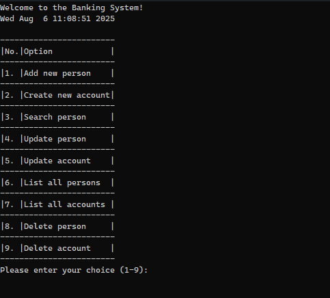
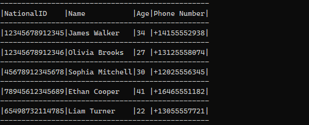
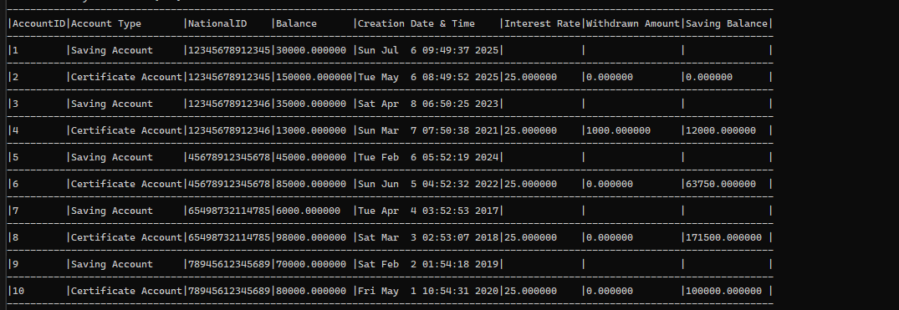
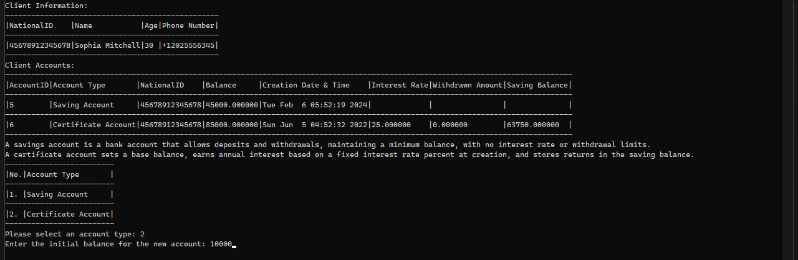
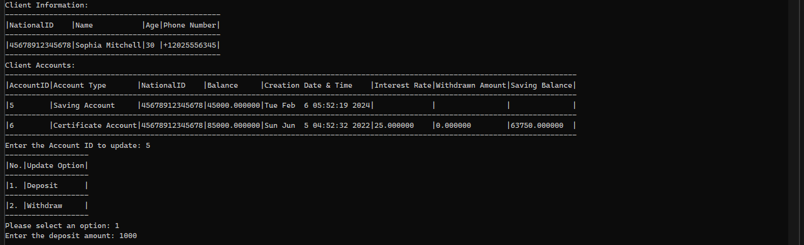
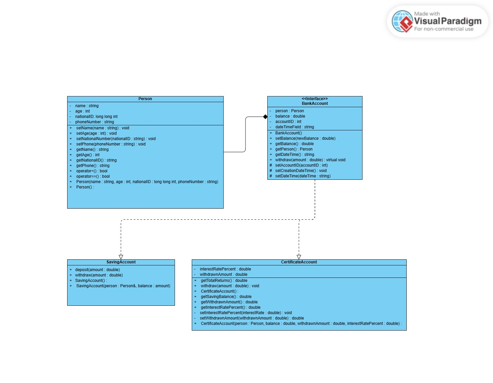

# Bank System Management 🏦

## Overview 📖
This project is a simple bank system management program developed as a practical application of my first-year computer science knowledge at university. It demonstrates fundamental programming concepts and techniques through the implementation of a console-based banking system.

## Features ✨
The program allows users to:
- **Manage Persons** 👤: Add persons with their national ID, update details (name, age, phone number), or delete them.
- **Manage Accounts** 💰: Create and manage two types of accounts linked to a person:
  - **Savings Account**: Initialize with a balance, supports deposits and withdrawals.
  - **Certificate Account**: Initialize with a base balance, earns annual interest based on the initial balance and interest rate, with returns stored in a savings balance available for withdrawal.
- **Data Persistence** 💾: Stores person and account data in `Persons.csv` and `Accounts.csv` files, loaded into vectors (`std::vector<Person>` for persons and `std::vector<std::vector<std::string>>` for accounts) shared across translation units for operations like add, delete, and update.

## Technical Implementation 🛠️
This project helped me apply and learn the following concepts and techniques:

### Object-Oriented Programming (OOP)
- **Encapsulation**: Learned to bundle person and account data with their methods in `Person`, `SavingsAccount`, and `CertificateAccount` classes to create self-contained units.
- **Abstraction**: Applied techniques to hide internal implementations, exposing only essential interfaces to simplify usage and ensure data integrity.
- **Inheritance**: Implemented a base `BankAccount` class inherited by `SavingsAccount` and `CertificateAccount` to understand shared functionality and specialization.
- **Polymorphism**: Used a pure virtual `withdraw` function in `BankAccount`, overridden in derived classes, to learn how to implement account-specific behavior.
- **Modular Design**: Separated class declarations and implementations into header (`.h`) and source (`.cpp`) files to improve code organization.
- **Friend Functions**: Explored how to use friend functions to access private/protected members for specific utility tasks.
- **Operator Overloading**: Applied custom operators for comparison and matching to facilitate searching and sorting operations.

### Algorithms
- **Binary Search**: Learned to implement binary search for efficient lookup of persons in the sorted `persons` vector.
- **String Tokenization**: Applied string parsing techniques to process CSV data effectively.
- **Problem-Solving**: Developed skills in designing solutions for real-world banking scenarios, such as account management and interest calculations.

### Output Formatting
- Learned to use C++ manipulators (e.g., `std::setw`, `std::left`) to format console output in structured, tabular displays for better readability.

### Exception Handling
- Implemented user-defined exception types to handle errors, learning how to ensure valid data for person and account objects.

### Structured Programming
- Applied structured programming by organizing code into functions for major tasks (e.g., CRUD operations, type conversions) to enhance clarity and maintainability.

### Modularity
- Learned to group related functionality into separate header and source files to create cleaner, more maintainable code.

### Date and Time (`ctime`)
- Explored `ctime` library functions to perform date-time operations, such as retrieving local time, calculating years since a specific date, and integrating date-based logic.

### File I/O
- Learned to manage persistent storage by implementing read/write operations for `Persons.csv` and `Accounts.csv` files.

### Standard Template Library (STL)
- Applied `std::vector` for dynamic data storage and learned to use STL algorithms like `std::sort` for efficient searching and sorting.

### Include Guards
- Learned to use include guards in header files to prevent multiple inclusions and ensure smooth compilation.

### UML Diagrams
- Designed simple UML class diagrams to understand and visualize the structure and relationships between `Person`, `BankAccount`, `SavingsAccount`, and `CertificateAccount` classes.

### Input Validation
- Learned to handle C++ input streams, validate user inputs, and implement error-handling mechanisms for robust program execution.

## Learning Outcomes 🎓
This project solidified my understanding of:
- Core OOP principles and their practical application.
- File I/O and data persistence in CSV format.
- Efficient use of STL containers and algorithms.
- Date-time manipulation for real-world scenarios.
- Structured and modular programming for maintainable code.
- Exception handling for robust error management.
- Console output formatting for user-friendly interfaces.
- UML design for planning and visualizing class relationships.

## How to Run 🚀
1. Clone the repository: `git clone https://github.com/thomas1854/bank-system-cpp.git`
2. Ensure a C++ compiler (e.g., g++) is installed.
3. Compile the project: `g++ *.cpp -o bank_system`
4. Run the executable: `./bank_system`
5. Follow the console prompts to interact with the system.

## 🖼️ Screenshots

## 🧩 UML Diagram

This diagram shows the structure and relationships between the main classes:

## License 📜
This project is licensed under the MIT License.
